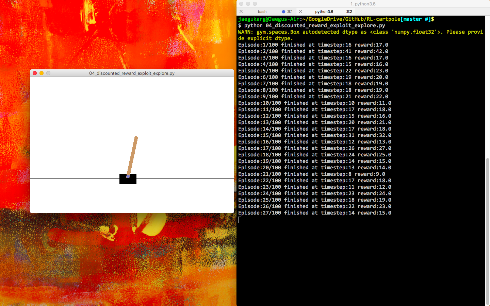

# cartpole game with reinforcement learning

* Source:
    * [Sunghun Kim](https://github.com/hunkim/ReinforcementZeroToAll)
    * [Tambet Matiisen](https://ai.intel.com/demystifying-deep-reinforcement-learning/)
    * [Matthew Chan](https://medium.com/@tuzzer/cart-pole-balancing-with-q-learning-b54c6068d947)

* Task: 
	* Make cart-pole stay still!  
	*  [Link](https://medium.com/@tuzzer/cart-pole-balancing-with-q-learning-b54c6068d947)  

* Experiment:
	* 00 - Play cartpole!
	* 01 - Random play
	* 02 - Simple update
	* 03 - Discounted reward
	* 04 - Exploit-Exploration (w/e-greedy)
	* 05 - Q-Net (Neural Net)
	* 06 - Deep Q-Net

* Requirements:
	* Install OpenAI `gym`

	
* Results:
	* 00 - Play cartpole! 
	* 01 - Random play 
	* 02 - Simple update 
	* 03 - Discounted reward 
	* 04 - Exploit-Exploration (w/e-greedy) 
	* 05 - Q-Net (Neural Net) 
	* 06 - Deep Q-Net